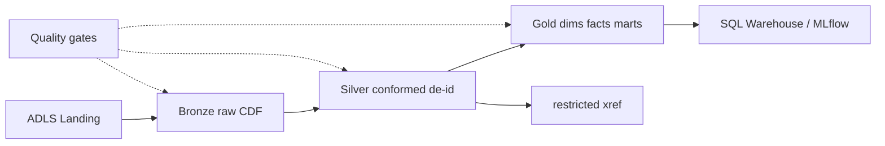

# Indominus Health Research Lakehouse

Production-grade **healthcare research Lakehouse** on Azure Databricks and Delta Lake.
Transforms synthetic clinical + patient-reported outcome (PRO) data into governed Bronze →
Silver → Gold models with HIPAA-aligned technical safeguards, fail-closed quality gates,
and research-grade reproducibility.

> **Compliance note:** This repository implements *technical safeguards that support* HIPAA
> Privacy and Security Rule expectations. Compliance also requires organizational policy,
> BAAs, workforce training, and audit. This code is **not** a certification.

## Quickstart (local, no Azure)

```bash
cp .env.example .env
python -m venv .venv
# Windows: .venv\Scripts\activate
source .venv/bin/activate
# Local Spark needs JDK 11/17 (set JAVA_HOME). On Windows, setup also fetches winutils.
make setup
make spark-smoke   # Phase 0: prove Spark + Delta
make test
make phi-scan
```

`make demo` runs Phases 1–8: synthetic → Bronze → Silver → DQ → Gold → cohort →
governance → Spark+Delta smoke.

## Architecture (target)



## Repository map

| Path | Purpose |
|------|---------|
| `src/hc_lakehouse/` | Transformations, privacy, quality, governance |
| `conf/` | Pipelines, contracts, DQ rules, cohorts, access matrix |
| `infra/terraform/` | Azure + Unity Catalog (Phase 10) |
| `tests/` | Unit, integration, privacy, quality |
| `docs/` | Architecture, HIPAA mapping, runbooks, ADRs |

## Assumptions

Resolved template defaults (org, region, Safe Harbor, k=11, etc.) live in
[`ASSUMPTIONS.md`](ASSUMPTIONS.md).

## Phase status

| Phase | Status |
|------|--------|
| 0 Scaffold | **Complete** |
| 1 Synthetic data | **Complete** |
| 2 Bronze | **Complete** |
| 3 Silver (core) | **Complete** |
| 4 Privacy / Safe Harbor | **Complete** |
| 5 Data quality | **Complete** |
| 6 Gold | **Complete** |
| 7 Cohorts + reproducibility | **Complete** |
| 8 Governance | **Complete** |
| 9–11 | Pending |

## License

Apache-2.0 (see package metadata). Synthetic data only — never commit real PHI.
