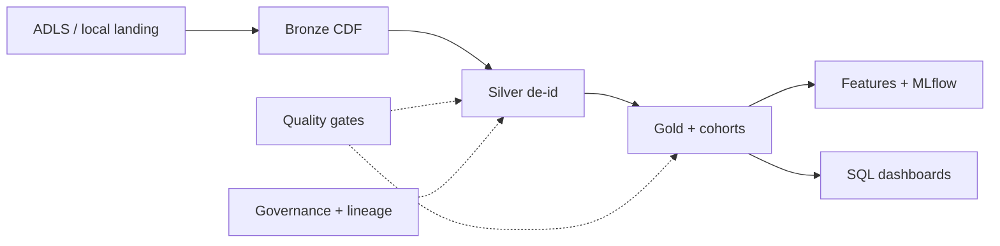

# Healthcare research Lakehouse — Indominus Health Research Consortium

Production-grade **healthcare research Lakehouse** on Azure Databricks and Delta Lake.
Transforms synthetic clinical + patient-reported outcome (PRO) data into governed Bronze →
Silver → Gold models with HIPAA-aligned technical safeguards, fail-closed quality gates,
research reproducibility, Unity Catalog governance, and research-only ML artifacts.

> **Compliance note:** This repository implements *technical safeguards that support* HIPAA
> Privacy and Security Rule expectations. Compliance also requires organizational policy,
> BAAs, workforce training, and audit. This code is **not** a certification.
>
> **ML note:** Models are research / decision-support artifacts only — **not** medical devices
> or clinical advice.

## Quickstart (local, no Azure)

```bash
cp .env.example .env
python -m venv .venv
# Windows: .venv\Scripts\activate
source .venv/bin/activate
# Local Spark needs JDK 11/17 (set JAVA_HOME). On Windows, setup also fetches winutils.
make setup
make spark-smoke
make test
make phi-scan
make demo
```

`make demo` runs Phases 1–11: synthetic → Bronze → Silver → DQ → Gold → cohort →
governance → features → ML → ops report → Spark smoke.

## Architecture



Details: [`docs/architecture.md`](docs/architecture.md) · index: [`docs/README.md`](docs/README.md)

## Repository map

| Path | Purpose |
|------|---------|
| `src/hc_lakehouse/` | Transforms, privacy, quality, governance, ML, ops, serving |
| `conf/` | Contracts, DQ, cohorts, access matrix, ML, SLA, cluster policies |
| `serving/sql/` | Dashboard SQL as code |
| `notebooks/` | Researcher onboarding |
| `pipelines/dlt/` | Cloud DLT Bronze→Silver |
| `resources/` | Databricks Asset Bundle jobs/pipelines |
| `infra/terraform/` | Azure + Unity Catalog |
| `tests/` | Unit, integration, privacy, quality |
| `docs/` | Architecture, HIPAA mapping, runbooks, ADRs |

## Assumptions

Resolved defaults (org, region, Safe Harbor, k=11, etc.): [`ASSUMPTIONS.md`](ASSUMPTIONS.md).

## Phase status

| Phase | Status |
|------|--------|
| 0 Scaffold | **Complete** |
| 1 Synthetic data | **Complete** |
| 2 Bronze | **Complete** |
| 3 Silver (core) | **Complete** |
| 4 Privacy / Safe Harbor | **Complete** |
| 5 Data quality | **Complete** |
| 6 Gold | **Complete** |
| 7 Cohorts + reproducibility | **Complete** |
| 8 Governance | **Complete** |
| 9 Data science / ML | **Complete** |
| 10 Orchestration / CI-CD | **Complete** |
| 11 Serving + docs | **Complete** |

## License

Apache-2.0 (see package metadata). Synthetic data only — never commit real PHI.
