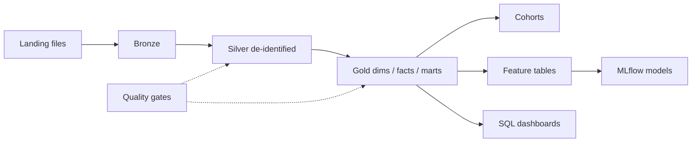

# Indominus Health Research Lakehouse

Azure Databricks + Delta Lake platform for healthcare research at Indominus Health
Research Consortium (INDHC).

The pipeline takes synthetic clinical and patient-reported outcome (PRO) data and
builds a governed medallion lakehouse: Bronze → Silver → Gold, with cohorts,
feature tables, and research-only models on top.

**Important**

- This repo implements technical controls that *support* HIPAA Privacy and Security
  Rule expectations. It is **not** a compliance certification. You still need BAAs,
  policies, training, and audit on the organization side.
- ML outputs are for research and decision support only. They are not medical devices
  and must not be used as clinical advice.
- Checked-in data is synthetic. Do not commit real PHI.

## Run it locally

You do not need an Azure subscription for the demo path.

```bash
cp .env.example .env
python -m venv .venv
# Windows: .venv\Scripts\activate
source .venv/bin/activate

# Spark needs JDK 11 or 17 (JAVA_HOME). On Windows, setup also installs winutils.
make setup
make spark-smoke
make test
make phi-scan
make demo
```

`make demo` walks the full local chain: generate synthetic data, ingest Bronze,
build Silver, run DQ, publish Gold, materialize a cohort, apply governance
artifacts, build features, train models, write an ops report, then spark smoke.

## How the data flows



More detail lives in [docs/architecture.md](docs/architecture.md). The full doc
index is [docs/README.md](docs/README.md).

## Layout

| Path | What it is |
|------|------------|
| `src/hc_lakehouse/` | Python package: ingest, transforms, privacy, DQ, ML, ops |
| `config/` | YAML contracts, DQ rules, cohorts, access matrix, ML + SLA settings |
| `dashboards/sql/` | Warehouse dashboard queries (versioned SQL) |
| `notebooks/` | Researcher onboarding notebook |
| `pipelines/dlt/` | Databricks DLT definition for Bronze → Silver |
| `resources/` | Databricks Asset Bundle job and pipeline specs |
| `infra/terraform/` | Azure storage / Key Vault / Unity Catalog scaffolding |
| `scripts/` | CLI entry points used by Make targets |
| `tests/` | Unit and integration tests |
| `docs/` | Architecture, runbooks, ADRs, HIPAA control notes |

Working defaults (region, catalogs, Safe Harbor, k=11, and so on) are written down
in [docs/assumptions.md](docs/assumptions.md).

## License

Apache-2.0. Synthetic data only.
