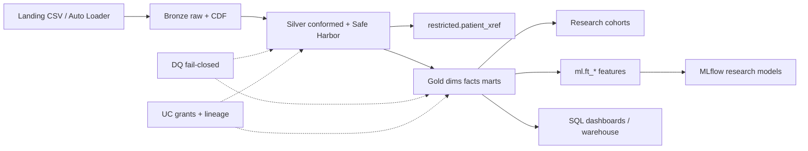
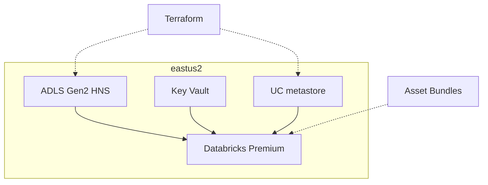

# Architecture

Indominus Health Research Consortium (INDHC) lakehouse on Azure Databricks + Delta Lake.
Local mode runs the same Python package with PySpark + `delta-spark`.

## End-to-end flow

## Azure landing zone

## Environment isolation

| Env | Catalog | Data |
|-----|---------|------|
| local/dev | `hc_dev` | Synthetic only |
| test | `hc_test` | Synthetic / approved fixtures |
| prod | `hc_prod` | Controlled research data (org-managed) |

Production data never flows backward into dev.
