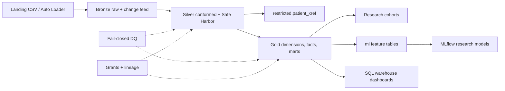
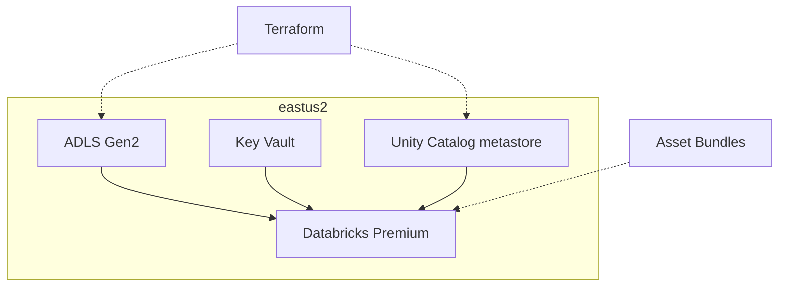

# Architecture

This lakehouse is built for Indominus Health Research Consortium (INDHC) on Azure
Databricks and Delta Lake. The same Python package runs locally with PySpark and
delta-spark, so engineers can develop and demo without a workspace.

## Pipeline

Bronze keeps the raw feed with technical columns and change data feed. Silver
cleanses, validates, and de-identifies. Gold is the Kimball layer researchers
actually query. Restricted crosswalk tables stay tightly gated.

## Azure shape

Local mode swaps ADLS paths for a folder under `.local_delta/` and skips live
Unity Catalog grant APIs. Grant SQL is still generated so it can be reviewed and
applied in the workspace.

## Environments

| Environment | Catalog | Data |
|-------------|---------|------|
| local / dev | `hc_dev` | Synthetic only |
| test | `hc_test` | Synthetic or approved fixtures |
| prod | `hc_prod` | Controlled research data (org-managed) |

Prod data does not flow back into lower environments.
