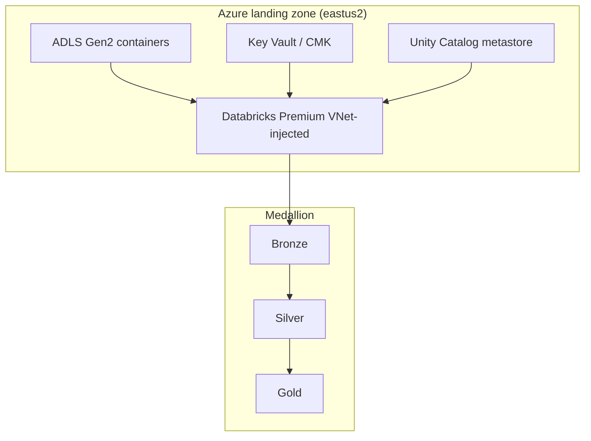

# Architecture

Phase 0 establishes the executable skeleton. Full medallion, Unity Catalog, and Azure
landing-zone detail is expanded in later phases. See `ASSUMPTIONS.md` for resolved defaults.

Local mode replaces ADLS paths with `.local_delta/` and skips Private Link / UC grant APIs.
