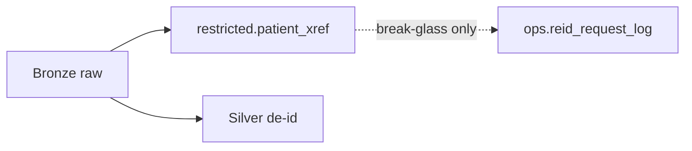

# De-identification methodology

**Standard:** HIPAA Safe Harbor (technical implementation). This repository
supports compliance; it is **not** a certification.

## Where PHI stops

## Techniques

| Identifier class | Treatment |
|------------------|-----------|
| Names, MRN-like tokens | Dropped from Silver |
| Source patient id | HMAC-SHA256 → `patient_sk`; original only in `restricted` |
| Dates | Birth → year + age band; event date-shift helper (±365d, deterministic) |
| Geography | ZIP5 → ZIP3; null if ZIP3 in low-population set |
| Ages > 89 | Band `90+` |
| Free text | Stripped / nulled |

## Pepper

Cloud: Azure Key Vault → Databricks secret scope. Local: `HC_DEID_SALT` demo value
only — rejected when `HC_RUNTIME_MODE` is not local.
