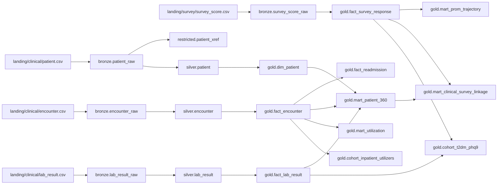

# Lineage

Auto-generated from `hc_lakehouse.governance.lineage.LINEAGE_EDGES`.
CI regenerates this file so the diagram cannot go stale.

Unity Catalog table/column lineage is the system of record in Azure; this graph is the local/demo snapshot mirrored into `ops.lineage_snapshot`.

